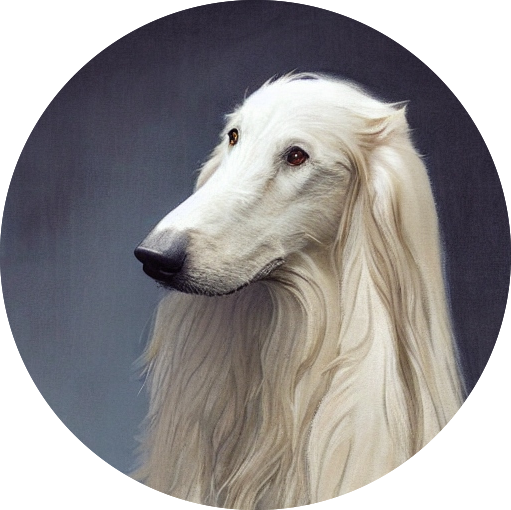

<div style="display:flex;align-items:center;justify-content:space-between;">
<h1 style="display:inline-block;">DoIt4U</h1>

</div>

DoIt4U is a natural language hybrid Python programming framework based on OpenAI API. DoIt4U is a conceptual prototype and not intended for use in production environments.

## Installation

    pip install doit4u

Before use the library, set your OpenAI API key as environement variable by running `add-key.sh` or following the [online tutorial](https://platform.openai.com/docs/quickstart/build-your-application).

## Usage

    from doit4u import DoIt4U

    doit = DoIt4U()     # Create client
    
    factorial = doit.forme(
        "Write me a factorial function that takes a number as input and returns the factorial of that number."
        )(5) ## When you don't know how to write factorial function, let me do it for you :)

## Example

Please note the generated functions might not always be correct, efficient, or secure. We encourage users to carefully test, and validate the generated code before using it in any project. 

Here are some of my test results:

**Example #1: Factorial function**

```
print(
    doit.forme(
        "Write me a factorial function that takes a number as input and returns the factorial of that number."
    )(5))


# result:
# 120
```

**Example #2: Calculate the area of a circle**

```
for i in range(1, 10):
    print(
        "Radius: ", i, "Area:",
        doit.forme(
            "Write me a function that takes the radius of a circle as input and returns the area of the circle."
        )(i))

# result:
# Radius:  1 Area: 3.14
# Radius:  2 Area: 12.56
# Radius:  3 Area: 28.26
# Radius:  4 Area: 50.24
# Radius:  5 Area: 78.5
# Radius:  6 Area: 113.04
# Radius:  7 Area: 153.86
# Radius:  8 Area: 200.96
# Radius:  9 Area: 254.34
```

**Example #3: Use of a library**

(Example 3 is not stable, sometimes the generated code cannot work correctly)
```
df = pd.DataFrame({
    "a": [1, 1, 3, 4],
    "b": ['a', 'a', 'b', 'b'],
    "c": [1, 2, 3, 4],
    "d": [-1, -2, -3, -4]
})

print(
    doit.forme(
        ''' Write me a function that takes a dataframe and a list of column names as input,
        Then aggregate the dataframe by the input list of names,
        Then get the the mean and maximum of the other columns by group as results,
        Then sort the results in reversed by order of the first column in the input list,
        Then return the aggregated result.
    ''')(df, ['a', 'b']))

# result:
# a  b    c        d    
#         mean max mean max
# 2  4  b  4.0   4 -4.0  -4
# 1  3  b  3.0   3 -3.0  -3
# 0  1  a  1.5   2 -1.5  -1
```

## Why?

The motivation of "natural language hybrid programming" is I realize it may not be practical to expect ChatGPT to write an entire program for you, but it can excel at crafting small, isolated functions. But again, this is only a prototype made by simple Python script without any optimization, don't count on it really do it for you.


*Project logo generated by diffusion model*

